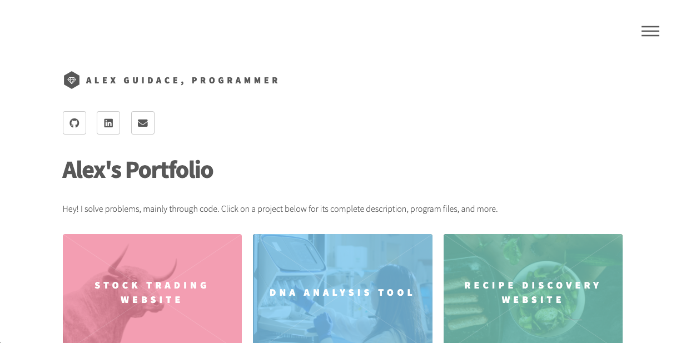

# **Alex Guidace's Portfolio Website**

# Description
A responsive website showing off some of my coding and user experience design projects.

Here's a partial image of the homepage. Click it for a larger version.

#

# Project Files

* [index.html](#index.html)
* [ux_design.html](#ux_design.html)

## index.html
My homepage. It's full of projects built in various languages!

## ux_design.html
A page concerning my knowledge and experience in the realm of user experience design and visual design.
